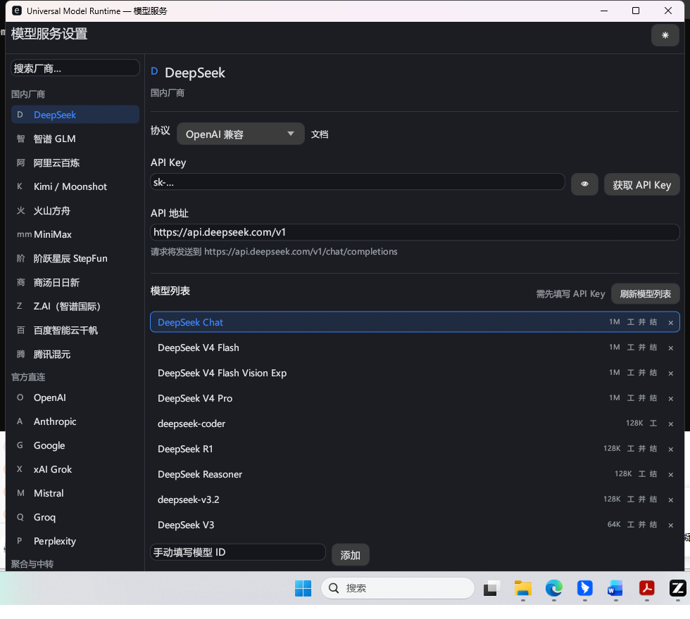

# Umber

[](https://github.com/elysia-ren/Umber/actions/workflows/ci.yml)

**Universal Embedded Model Runtime** — 可嵌入的统一 AI 模型运行时。随宿主软件分发、直接链接进宿主进程：把协议差异、
模型知识、流式行为、错误分类与凭据处理统一消化，宿主只面对一套稳定的 Canonical API。

[English](README.md)

## 为什么需要它

哪怕只接几家厂商，宿主也要自己拥有：多套线上协议、多种流式方言、多套错误词汇表、
多种工具调用编码，外加重试、超时、取消与密钥管理。这个 Runtime 把这些做一次，
并在厂商变更时持续维护。

| | |
|---|---|
| **一套 Canonical API** | Request / Event / Response / Error / Invocation / Usage 不泄漏任何厂商细节，宿主代码不需要按厂商分支。 |
| **四协议一个形状** | `openai_chat` / `openai_responses` / `anthropic_messages` / `gemini`，含真实 HTTP 与 SSE 传输。 |
| **可信的流式** | 每次调用恰好一个终结事件、`sequence` 严格递增、Delta 只增不改；失败与取消后仍可取回部分结果。 |
| **模型知识** | 离线目录提供规范模型身份的能力、上下文上限、价格与证据；`未知` 就如实是未知，不编造。 |
| **凭据处理** | 密钥不进配置文件、目录与日志；宿主 → 系统钥匙串 → 加密文件，落到最弱层时强制告警。 |
| **可嵌入的接口面** | 稳定的拉取式 C ABI（不把 async 暴露过 FFI 边界）与零依赖 Python 绑定；Rust 宿主直接依赖 crate。 |

## 保证

以下都是契约级承诺，每条都有 conformance 套件覆盖。

```text
终结事件   断流 / 畸形 SSE / 超时 / 取消 → 恰好一个 completed | failed | cancelled
部分结果   失败或取消前已产出的内容与 usage 仍可取回
全局序号   每个事件带严格递增的 sequence；并行工具调用按 call_id / index 重组
四段超时   connect / first_token / idle / total，由 Engine 统一执行
安全重试   已产出内容的请求绝不盲目重放
错误分类   14 类 Canonical 错误；宿主不解析 HTTP 状态码
脱敏       敏感 header 与 JSON key 强制脱敏，密钥输出为 ***
```

## 仓库结构

```text
umber-core/           Canonical API 契约（Request / Event / Response / Error / Invocation / Usage）
umber-model/          模型智能（身份 / 部署 / 能力 / 证据 / 解析 / 目录 / 注册表 / 探针）
umber-engine/         调用引擎（终结保证 / 四段超时 / 重试 / 部分结果 / 取消）
umber-provider/       Provider Adapter trait
umber-protocol/       四协议 Adapter、真实 HTTP 传输、SSE 与错误映射
umber-conformance/    Conformance 套件（fake provider / 断言库 / fixture 格式）
umber-credential/     CredentialStore 契约、内存实现、脱敏工具
umber-credential-os/  平台凭据（系统钥匙串 / 加密文件 / 回退链）
umber-ui/             UISpec 契约（设置 schema / 校验 / 发现状态机 / i18n）
umber-ui-egui/        参考设置界面（可替换；视觉层不是契约）
umber-ffi/            Stable C ABI（拉取式）+ C / Python 绑定
umber-data/           模型数据管线与本地库（`model-data` CLI）
```

一条铁律由编译器强制：**只有 `umber-ffi` 允许 `unsafe`，其余 crate 一律
带 `#![forbid(unsafe_code)]`。**

## 快速开始

### Rust

```rust
use std::sync::Arc;

use umber_core::{message::Message, request::GenerateRequest};
use umber_credential::{CredentialRef, InMemoryCredentialStore, SecretString};
use umber_engine::{run_invocation, CancelToken, RetryPolicy, TimeoutPolicy};
use umber_model::deployment::{Deployment, Endpoint, ProtocolKind};
use umber_protocol::{HttpConfig, HttpTransport, OpenAiChatAdapter, RealHttpTransport};
use umber_provider::ProviderAdapter;

// 1) 凭据按引用传递，绝不内联进请求
let credentials = InMemoryCredentialStore::new();
let key_ref = CredentialRef::from("deepseek/api_key");
credentials.set(&key_ref, SecretString::new(std::env::var("DEEPSEEK_API_KEY")?))?;

// 2) Endpoint 可自由覆盖；3) Deployment 指向 Provider 侧模型 ID
let endpoint = Endpoint {
    id: "ep-1".into(),
    provider_id: "deepseek".into(),
    url: "https://api.deepseek.com/v1".into(),
};
let deployment = Deployment {
    id: "deepseek/official/openai_chat/deepseek-chat".into(),
    endpoint_id: endpoint.id.clone(),
    protocol: ProtocolKind::OpenAiChat,
    model_id: "deepseek-chat".into(),
};

// 4) Adapter 负责协议转换，Engine 负责调用生命周期
let transport: Arc<dyn HttpTransport> = Arc::new(RealHttpTransport::new(HttpConfig::default()));
let adapter = OpenAiChatAdapter::new(transport);
let request = GenerateRequest::new(deployment.id.clone(), vec![Message::user("你好")]);

let factory = {
    let (endpoint, deployment, request, credentials, key_ref) = (
        endpoint.clone(),
        deployment.clone(),
        request.clone(),
        credentials,
        key_ref.clone(),
    );
    move || adapter.execute(&request, &endpoint, &deployment, &credentials, &key_ref)
};

let mut events = Vec::new();
let outcome = run_invocation(
    &factory,
    &request,
    &CancelToken::new(),
    &TimeoutPolicy::default(),
    &RetryPolicy::default(),
    &mut |event| events.push(event),
);

// outcome.response: Option<GenerateResponse>（stop_reason / content / usage）
// outcome.partial : 失败或取消后仍可取回的内容与 usage
```

### C / C++

C ABI 是拉取式的：你主动要下一个事件，最多阻塞 `timeout_ms`。

```c
#include <string.h>
#include "umber.h"

if (runtime_abi_version() >> 16 != 0) { /* 主版本不匹配：拒绝启动 */ }

UmerRuntime* rt = runtime_init();

/* 注册部署：请求里的 model 必须与此处的 id 完全一致 */
const char* config =
    "{\"id\":\"deepseek/official/openai_chat/deepseek-chat\","
    "\"provider_id\":\"deepseek\","
    "\"protocol\":\"openai_chat\","
    "\"endpoint_url\":\"https://api.deepseek.com/v1\","
    "\"model_id\":\"deepseek-chat\","
    "\"credential_ref\":\"deepseek/api_key\"}";
runtime_set_deployment(rt, config, strlen(config));

/* 凭据只在内存；持久化由宿主自己交给系统钥匙串 */
runtime_set_credential(rt, "deepseek/api_key", getenv("DEEPSEEK_API_KEY"));

/* 可选：离线模型知识 */
runtime_load_catalog(rt, "catalog.json");

const char* req =
    "{\"model\":\"deepseek/official/openai_chat/deepseek-chat\",\"messages\":["
    "{\"role\":\"user\",\"content\":[{\"type\":\"text\",\"text\":\"你好\"}]}]}";

UmerStream* stream = NULL;
runtime_stream_open(rt, req, strlen(req), &stream);

UmerEvent ev;
for (;;) {
    int32_t status = runtime_stream_next(stream, 2000, &ev);
    if (status == UMER_EVENT) {
        /* ev.json 归调用方所有：必须释放恰好一次 */
        puts(ev.json);
        runtime_string_free((char*)ev.json);
    } else if (status == UMER_WOULD_BLOCK) {
        continue;               /* 超时但流未关闭 */
    } else if (status == UMER_CLOSED) {
        break;                  /* 终结事件已交付 */
    } else {
        break;                  /* 负数是错误码，见 umber.h */
    }
}
runtime_stream_close(stream);
runtime_shutdown(rt);
```

编译自带示例（Windows / MSVC）：

```bat
cl /I include examples\host_example.c /Fe:host_example.exe /link lib\umber_ffi.dll.lib
```

当请求的 model 没有对应部署、且没有显式开启内置 demo 源时，
`runtime_stream_open` 返回 `UMER_ERR_NOT_CONFIGURED`：Runtime 绝不静默返回假数据。

### Python

`umber-ffi/bindings/python/umber.py` 只用标准库。

```python
from umber import Runtime

with Runtime() as rt:                       # 自动校验 ABI 主版本
    rt.set_deployment({
        "id": "deepseek/official/openai_chat/deepseek-chat",
        "provider_id": "deepseek",
        "protocol": "openai_chat",
        "endpoint_url": "https://api.deepseek.com/v1",
        "model_id": "deepseek-chat",
        "credential_ref": "deepseek/api_key",
    })
    rt.set_credential("deepseek/api_key", "sk-...")
    rt.load_catalog("catalog.json")         # 可选，离线可用

    request = {
        "model": "deepseek/official/openai_chat/deepseek-chat",
        "messages": [{"role": "user", "content": [{"type": "text", "text": "你好"}]}],
    }
    with rt.stream(request) as stream:
        for event in stream:                # 读到终结事件自动停止
            inner = event["data"]["event"]
            if inner["type"] == "text_delta":
                print(inner["delta"], end="", flush=True)
```

## 参考设置界面



`umber-ui-egui` 是只依赖 `umber-ui` 数据契约实现的可用设置窗口：schema 驱动表单、
明暗双主题 token、从系统加载 CJK 回退字体、无头帧测试。它访问网络、磁盘与钥匙串
全部经由宿主实现的 `SettingsBackend`，因此替换它不会触及契约。内置预设覆盖
32 家厂商、四种协议；每家厂商的计费方式（按量付费与订阅 / Coding Plan）作为同一
部署下的不同端点呈现，切换计费方式不会产生第二条厂商条目。

## 构建与测试

```text
cargo test                                  # 全量测试
cargo clippy --all-targets -- -D warnings   # 零警告门禁
cargo fmt                                   # 格式化

# C ABI 示例（Windows / MSVC）
umber-ffi\examples\build_example.cmd debug

# 由 Rust 类型重新生成 C 头文件（Rust 类型是唯一真值）
cbindgen --config umber-ffi/cbindgen.toml --crate umber-ffi -o umber-ffi/include/umber.h
```

Linux 上 `umber-credential-os` 经 `libdbus` 访问 Secret Service，构建需要
`libdbus-1-dev` 与 `pkg-config`：

```bash
sudo apt-get install -y libdbus-1-dev pkg-config
```

Rust stable，edition 2021，MSRV 1.75。CI 在 Windows / macOS / Linux 上跑
`cargo fmt --check`、`cargo clippy --all-targets -- -D warnings` 与 `cargo test`。
需要真实网络或写真实系统钥匙串的测试都标了 `#[ignore]` 且需显式开启，
因此 CI 不会消耗 Token、也不会改动开发机。

## 文档

```text
docs/HOST_INTEGRATION.md   宿主集成指南（Rust、凭据、代理、C ABI、Python）
docs/MODEL_DATA.md         模型数据管线、证据链、许可证门禁
docs/CONTRACT_REVIEW.md    契约对照表：每条契约落在哪段代码
docs/architecture/         V0 架构总案与开发计划
```

## 许可

**MIT OR Apache-2.0** 双许可，任选其一，见 `LICENSE-MIT` 与 `LICENSE-APACHE`。
允许随闭源宿主软件分发。

随包模型数据只由**可再分发**的上游生成（当前均为 MIT 许可）。条款不允许再分发的
数据源只作为构建期参考，绝不进入随包目录。
